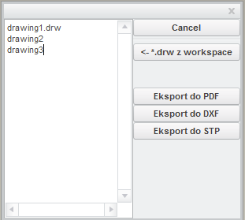

# CreoBatch

Creo plugin: batch export drawings to dxf or pdf or 3d models (parts and assembly) to step file format. 

It allows to batch export a list of drawings into the pdf or dxf file format. It can automatically fetch all drawings from the active workspace to the export list.
